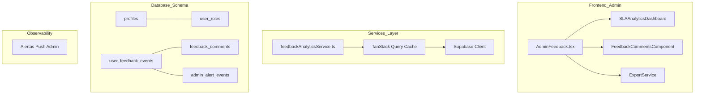

# Plano de Arquitetura — V1.3 (SLA Optimization & Collaboration)

Este documento descreve a visão técnica e as decisões arquiteturais para a versão 1.3 do SLA Analytics Dashboard.

## 1. Visão Geral
A V1.3 foca em transformar o dashboard de uma ferramenta de visualização passiva em uma plataforma de gestão ativa e colaborativa. Os pilares são: **Atribuição**, **Comunicação Interna**, **Automação de Alertas** e **Modernização do Data Fetching**.

## 2. Diagrama de Módulos Impactados

## 3. Impacto por Área

### 3.1. Banco de Dados (Schema)
- **`user_feedback_events`**: Utilização intensiva do campo `assigned_to` para o Filtro por Gestor.
- **[NOVA] `feedback_comments`**: Tabela para armazenar a thread de colaboração entre admins (id, feedback_id, author_id, content, created_at, is_internal).
- **`admin_alert_events`**: Integração para disparar alertas quando `sla_breached_...` for iminente.

### 3.2. Serviços (Backend/Logic)
- **Migração de Cache**: Remoção do cache manual em `feedbackAnalyticsService.ts` em favor do TanStack Query (`staleTime`, `gcTime`).
- **Lógica de Exportação**: Novo serviço utilitário para converter o estado atual do `getSLAAnalyticsData` em formatos CSV e PDF.

### 3.3. Interface (UX/UI)
- **Filtro por Gestor**: Novo Select no `AdminFeedback.tsx` populado via `profiles` filtrados por role `admin/owner`.
- **Painel de Comentários**: Sidebar ou Modal para troca de mensagens internas entre gestores.

## 4. Decisões Arquiteturais e Trade-offs

| Decisão | Motivo | Trade-off |
| :--- | :--- | :--- |
| **TanStack Query** | Gerenciamento de estado de servidor padronizado e invalidação automática. | Adição de uma dependência core; curva de aprendizado inicial para refatoração. |
| **Exportação Client-side** | Agilidade na entrega e menor carga no banco/edge functions. | Limitação de volume de dados (browser memory) para relatórios gigantes (+10k records). |
| **Tabela de Comentários Dedicada** | Permite auditoria completa e threads reais, diferente de um campo de texto único. | Maior complexidade em joins e necessidade de nova migration. |
| **Alertas Push via UI + Toast** | Implementação imediata via Context API/Polling antes de WebPush complexo. | O Admin precisa estar com a aba aberta para receber o alerta em real-time. |

---
**Data:** 2026-02-13
**Versão:** 1.0 (Draft Planejamento)
